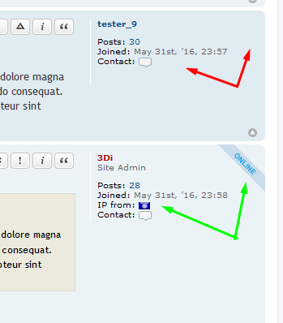

# IP Country Flag

Master brach status: 

IP Country Flag is an extension that requires at least phpBB version 3.1.9, works also on 3.2.x.
This is a port of the MOD I made first for phpBB2 and Categories Hiearchy MOD, then for phpBB3 (Olympus).

That would be a sort of Country Flags Invasion..

View Topic mini-profile once the User is logged in

